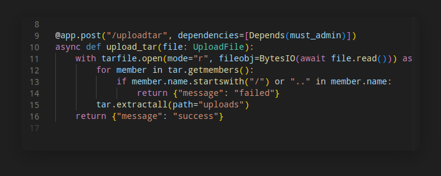

#Summary
Challenge ini terdapat 3 vulnerability dan 1 bypass.

Vulnerabilty pertama adalah zip slip yang bisa diakses user, zip slip ini bisa melakukan symlink dan juga arbitary file read via symlink yang bisa kita gunakan untuk membaca SECRET_KEY yang terdapat di dalam /proc/self/environ untuk melakukan tamper JWT.

vulnerability ke-2 adalah tar slip yang terdapat di admin side, setelah melakukan JWT tamper dan mendapatkan akses admin, kita dapat melakukan tar slip yang bisa kita gunakan untuk melakukan file write.
bypass... karna terdapat restriksi di filename sebagai berikut

kita tidak bisa langsung menggunakan local file inclusion di filename, oleh karena itu kita melakukan LFI di symlink, dan me link folder parent ke current folder untuk mewrite file didalam ./config, untuk lebih jelasnya bisa dilihat solver diatas di bagian upload_exploit method
Vulnerability ke-3 yaitu yaml deserialization
kurang lebih exploitasinya seperti di solver diatas
